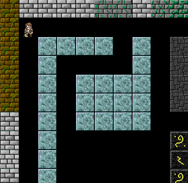

# Amazeman!

This will be a 2D top-down maze escape game.

My goal was to figure out by myself how to implement scrolling maps in the game. 

Currently that works fine. 

Now I want to transform this code into an enjoyable game.

DONE
- importing map from the [editor](https://github.com/gamedevnull/2dmapeditor)
- partial map rendering in the viewport
- scrolling when the player moves around
- wall collisions

TODO
- separate class for map scrolling and wall collisions, refactor, etc
- configuration for game elements like width, height, etc
